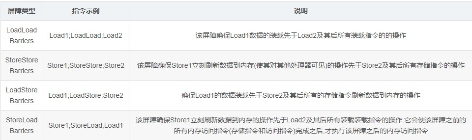

# 任务队列、CPU Load

## 一、CPU Load

**cpu load是对使用或者等待cpu进程的统计(数量的累加):**每一个使用(running)或者等待(runnable)CPU的进程，都会使load值+1；每一个结束的进程，都会使load值-1。
大部分Unix操作系统只计算running和runnable的进程。但是Linux系统除了上述两种状态进行，还计算uninterruptible sleep状态的进程(通常是在等待磁盘IO)。

cpu load average:分别表示1分钟、5分钟和15分钟内的cpu负载均值,使用命令：w,uptime,top。

```shell
root@ubuntu:~# w
 02:38:52 up 7 min,  1 user,  load average: 0.16, 0.64, 0.47
USER     TTY      FROM             LOGIN@   IDLE   JCPU   PCPU WHAT
root     pts/0    192.168.139.1    02:38    2.00s  0.03s  0.00s w
root@ubuntu:~# uptime
 02:38:58 up 7 min,  1 user,  load average: 0.15, 0.63, 0.47
root@ubuntu:~# top
top - 02:39:18 up 7 min,  1 user,  load average: 0.11, 0.59, 0.46
Tasks: 253 total,   1 running, 165 sleeping,   0 stopped,   0 zombie
%Cpu(s):  0.1 us,  0.0 sy,  0.0 ni, 99.9 id,  0.0 wa,  0.0 hi,  0.0 si,  0.0 st
KiB Mem :  4015856 total,  2230328 free,   691024 used,  1094504 buff/cache
KiB Swap:  1942896 total,  1942896 free,        0 used.  3051876 avail Mem 

   PID USER      PR  NI    VIRT    RES    SHR S  %CPU %MEM     TIME+ COMMAND                             
  2596 root      20   0   44216   4092   3348 R   0.3  0.1   0:00.02 top                                 
     1 root      20   0  225552   9216   6700 S   0.0  0.2   0:03.54 systemd                             
     2 root      20   0       0      0      0 S   0.0  0.0   0:00.04 kthreadd                                                    

```


## 二、工作队列(workqueue)

工作队列(workqueue)是Linux内核中把工作延迟执行的一种手段，工作队列主要目的是节省资源，不创建线程，没有CPU和内存开销，其比较适合很微小的任务，比如执行某个唤醒工作等。

## 三、指令乱序

通过改变原有执行顺序而减少时间的执行过程称之为乱序执行,也称为重排，在单核情况下，乱序技术提高了运算速度。

### (1)处理器乱序分类

现代处理器采用指令并行技术,在不存在数据依赖性的前提下,处理器可以改变语句对应的机器指令的执行顺序来提高处理器执行速度；
现代处理器采用内部缓存技术,导致数据的变化不能及时反映在主存所带来的乱序；
现代编译器为优化而重新安排语句的执行顺序；

### (2)as-if-serial语义

无论是处理器还是编译器,不管怎么重排都要保证(单线程)程序的执行结果不能被改变,这就是as-if-serial语义.比如烧水煮茶的最终结果永远是煮茶,而不能变成烧水.为了遵循这种语义,处理器和编译器不能对存在数据依赖性的操作进行重排,因为这种重排会改变操作结果

## 四、内存屏障

对于多核情况，其中的某些”自作聪明”的乱序优化导致多线程程序产生各种各样的意外.因此有必要存在一种机制来消除乱序执行带来的坏影响,也就是说应该允许程序员显式的告诉处理器对某些地方禁止乱序执行.这种机制就是所谓内存屏障.
不同架构的处理器在其指令集中提供了不同的指令来发起内存屏障,对应在编程语言当中就是提供特殊的关键字(比如：volatile)来调用处理器相关的指令.

内存屏障的分类：
Store就是将处理器缓存中的数据刷新到内存中,而Load则是从内存拷贝数据到缓存当中.



StoreLoad Barriers同时具备其他三个屏障的效果,因此也称之为全能屏障,是目前大多数处理器所支持的,但是相对其他屏障,该屏障的开销相对昂贵.在x86架构的处理器的指令集中,lock指令可以触发StoreLoad Barriers.