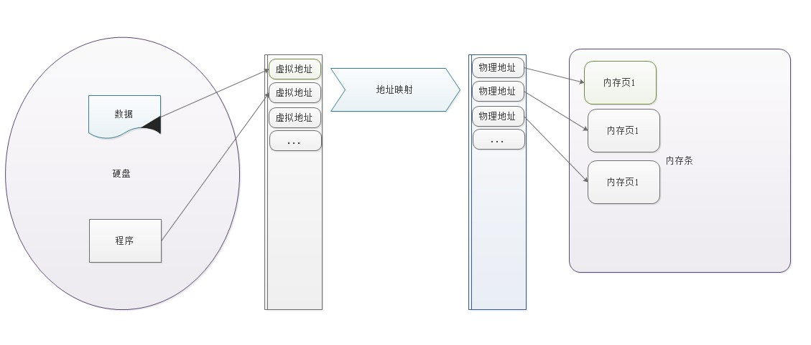
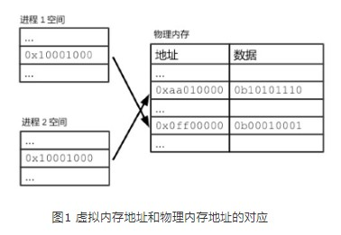
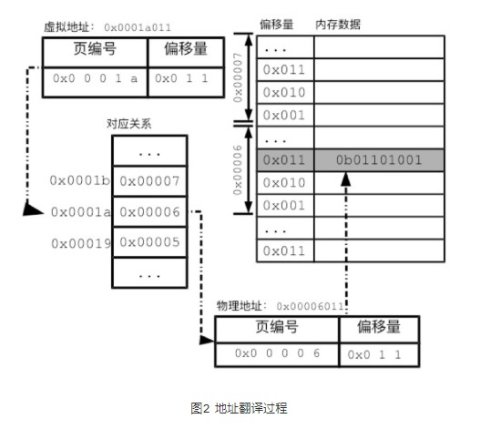
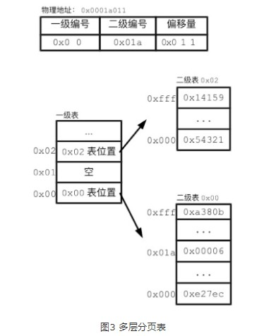

# 内存分页管理与swap

## 一、虚拟内存

程序运行会启动一个进程，进程里有程序段、全局数据、栈和堆，这些都会加载到内存里，每一部分都有对应的内存地址，进程就是一直在处理这些地址中数据。
**然而在Linux下，进程不能直接读写内存地址。**
进程中能访问的地址，只能是**虚拟内存地址**（virtual memory address）。
操作系统会把虚拟内存地址翻译成真实的内存地址。
这种内存管理方式，称为虚拟内存（virtual memory）。

### 特点

1、虚拟内存地址和物理内存地址类似，都是为数据提供位置索引；
2、虚拟内存地址和物理内存地址通过映射关系来关联；
3、不同进程都有自己的一套虚拟内存地址，用来给自己的进程空间编号；
4、进程的虚拟内存地址相互独立。因此，两个进程空间可以有相同的虚拟内存地址，如0x10001000。
5、应用程序的数据读写操作的是虚拟地址，对物理内存地址一无所知。
6、程序中表达的内存地址，也都是虚拟内存地址。
7、进程对虚拟内存地址的操作，会被操作系统翻译成对某个物理内存地址的操作。

### 优势：

1、借助虚拟内存地址，操作系统可以保障进程空间的独立性，不同进程就不可能相互篡改对方的数据，进程出错的可能性就大为减少。
2、有了虚拟内存地址，内存共享也变得简单。操作系统可以把同一物理内存区域对应到多个进程空间。这样，不需要任何的数据复制，多个进程就可以看到相同的数据。内核和共享库的映射，就是通过这种方式进行的.

## 二、内存分页

通过上面对虚拟内存的介绍得知，操作系统必须能高效地翻译虚拟内存和物理内存地址映射。

### 分页

**Linux采用了分页（paging）的方式来记录对应关系。**
所谓的分页，就是以更大尺寸的单位页（page）来管理内存。
内存分页，可以极大地减少所要记录的内存对应关系。我们已经看到，以字节为单位的对应记录实在太多。如果把物理内存和进程空间的地址都分成页，内核只需要记录页的对应关系，相关的工作量就会大为减少。
在Linux中，通常每页大小为4KB。
使用命令查看内存页大小：

```shell
root@ubuntu:~# getconf PAGE_SIZE
4096
```



### 多级分页表

单一的连续分页表，需要给每一个虚拟页预留一条记录的位置。但对于任何一个应用进程，其进程空间真正用到的地址都相当有限。我们还记得，进程空间会有栈和堆。进程空间为栈和堆的增长预留了地址，但栈和堆很少会占满进程空间。这意味着，如果使用连续分页表，很多条目都没有真正用到。因此，L**inux中的分页表，采用了多层的数据结构。多层的分页表能够充分利用内存空间。**

比如两级分页表：一级分页表记录一级表和二级表映射关系，二级表记录二级表和物理地址映射关系。



## 三、swap

### 1、swap是什么？

swap字面意思是交换，指硬盘上一块分区或者文件。
在Linux上可以使用`swapon -s`命令查看当前系统上正在使用的交换空间清单：

```shell
root@ubuntu:~# swapon -s
Filename				Type		Size	Used	Priority
/swapfile               file    	1942896	0	    -2
```

### 2、swap作用

当物理内存（内存条）不够用的时候，将部分内存上的数据交换到swap空间上，以便让系统不会因内存不够用而导致`OOM (OutOfMemory)`或者更致命的情况出现。
当某进程向OS请求内存发现不足时，OS会把内存中暂时不用的数据交换出去，放在SWAP分区中，这个过程称为`SWAP OUT`。
当某进程又需要这些数据且OS发现还有空闲物理内存时，又会把SWAP分区中的数据交换回物理内存中，这个过程称为`SWAP IN`。

### 3、内存回收

使用swap是内存回收机制一项实现方式。

#### 3.1内核进行内存回收的主要原因有两个：

(1)内核需要为任何时刻突发到来的内存申请提供足够的内存，所以一般情况下保证有足够的free空间对于内核来说是必要的。

(2)Linux内核使用cache的策略虽然是不用白不用，内核会使用内存中的page cache对部分文件进行缓存，以便提升文件的读写效率。所以内核有必要设计一个周期性回收内存的机制，以便cache的使用和其他相关内存的使用不至于让系统的剩余内存长期处于很少的状态。

#### 3.2两种内存回收机制：

(1)使用`kswapd`进程对内存进行周期检查，以保证平常状态下剩余内存尽可能够用;

(2)直接内存回收（directpagereclaim），就是当内存分配时没有空闲内存可以满足要求时，触发直接内存回收。

#### 3.3内存回收会对两种内存的使用进行回收:

(1)**匿名内存**，这部分内存没有实际载体，不像文件缓存有硬盘文件这样一个载体，比如典型的堆、栈数据等。这部分内存在回收的时候不能直接释放或者写回类似文件的媒介中，这才搞出来swap这个机制，将这类内存换出到硬盘中，需要的时候再加载出来。

(2)**文件缓存**，为了避免文件数据每次都要从硬盘读取，系统会将热点数据存储在内存中，提高性能。如果仅仅将文件读出来，内存回收只需要释放这部分内存即可，下次再次读取该文件数据直接从硬盘中读取即可（类似HBase文件缓存）。那如果不仅将文件读出来，而且对这些缓存的文件数据进行了修改**（脏数据）**，回收内存就需要将这部分数据文件写会硬盘再释放（类似MySQL文件缓存）。

#### 3.4 swappiness

swappiness的值定义内核使用swap的积极程度,用来控制内存回收时，回收的匿名页更多一些还是回收的file cache更多一些 。
这只是个倾向性，是指在两个都够用的情况下，更愿意用哪个，如果不够用了，那么该交换还是要交换
默认值是60，可以的取值范围是0-100;
值越高，内核就会越积极的使用swap；值越低，就会降低对swap的使用积极性;
如果swappiness设置为0，尽量少用swap，但并代表不用，如果不够用了，那么该交换还是要交换；
如果swappiness设置为100，那么匿名页和文件将用同样的优先级进行回收。

```shell
root@ubuntu:~# cat /proc/sys/vm/swappiness 
60
```

#### 3.5、内存回收策略

参数：zone_reclaim_mode这个参数定义了NUMA架构下不同的内存回收策略，

echo 0 > /proc/sys/vm/zone_reclaim_mode：在local内存不够用的情况下可以去其他的内存区域分配内存；
echo 1 > /proc/sys/vm/zone_reclaim_mode：表示打开zone_reclaim模式，在local内存不够用的情况下本地先回收再分配；
echo 2 > /proc/sys/vm/zone_reclaim_mode：本地回收尽可能先回收文件缓存对象；在本地回收内存时，可以将cache中的脏数据写回硬盘，以回收内存。
echo 4 > /proc/sys/vm/zone_reclaim_mode：可以用swap方式回收内存。

#### 3.6 kswapd周期检查和内存标记水位线

Linux内核使用水位标记（watermark）的概念来描述内存压力情况，三种内存水位标记:high、low、min
(1)剩余内存在high以上表示内存剩余较多，目前内存使用压力不大；
(2)high-low的范围表示目前剩余内存存在一定压力；
(3)low-min表示内存开始有较大使用压力，剩余内存不多了；
(4)min是最小的水位标记，当剩余内存达到这个状态时，就说明内存面临很大压力。
(5)小于min这部分内存，内核是保留给特定情况下使用的，一般不会分配。

所有的内存watermark标记都是根据当前内存总大小和一个可调参数进行运算得来的，这个参数是：`/proc/sys/vm/min_free_kbytes`

内存回收行为就是基于剩余内存的水位标记进行决策的：
当系统剩余内存低于watermark[low]的时候，内核的kswapd开始起作用，进行内存回收。直到剩余内存达到watermark[high]的时候停止。
如果内存消耗导致剩余内存达到了或超过了watermark[min]时，就会触发直接回收（direct reclaim）。

### 4、swap优先级

在使用多个swap分区或者文件的时候，还有一个优先级的概念（Priority）。
在swapon的时候，我们可以使用-p参数指定相关swap空间的优先级，值越大优先级越高，可以指定的数字范围是－1到32767。
内核在使用swap空间的时候总是先使用优先级高的空间，后使用优先级低的。

### 5、数据库系统讨厌swap

swap机制的初衷是为了缓解物理内存用尽而选择直接粗暴OOM进程的尴尬。但几乎所有数据库对swap都不怎么待见，无论MySQL、Oracal、MongoDB抑或HBase，为什么？

(1)数据库系统一般都对响应延迟比较敏感，如果使用swap代替内存，数据库服务性能必然不可接受。对于响应延迟极其敏感的系统来讲，延迟太大和服务不可用没有任何区别，比服务不可用更严重的是，swap场景下进程就是不死，这就意味着系统一直不可用……再想想如果不使用swap直接oom，是不是一种更好的选择，这样很多高可用系统直接会主从切换掉，用户基本无感知。

(2)对于诸如HBase这类分布式系统来说，其实并不担心某个节点宕掉，而恰恰担心某个节点夯住。一个节点宕掉，最多就是小部分请求短暂不可用，重试即可恢复。但是一个节点夯住会将所有分布式请求都夯住，服务器端线程资源被占用不放，导致整个集群请求阻塞，甚至集群被拖垮。