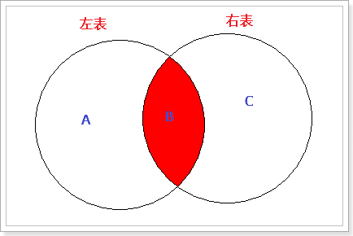
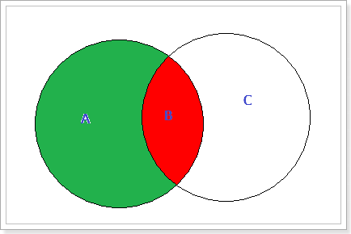
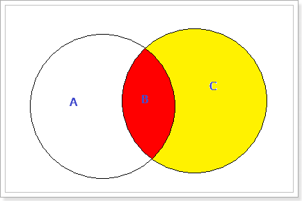

## SQL

### 1.什么是SQL？

​	Structured Query Language：结构化查询语言
​	其实就是定义了操作所有关系型数据库的规则。每一种数据库操作的方式存在不一样的地方，称为“方言”。
​	

### 2.SQL通用语法

	1. SQL 语句可以单行或多行书写，以分号结尾。
	2. 可使用空格和缩进来增强语句的可读性。
	3. MySQL 数据库的 SQL 语句不区分大小写，关键字建议使用大写。
	4. 3 种注释
		* 单行注释: -- 注释内容 或 # 注释内容(mysql 特有) 
		* 多行注释: /* 注释 */


### 3.SQL分类

#### 1) DDL(Data Definition Language)数据定义语言

​	用来定义数据库对象：数据库，表，列等。关键字：create, drop,alter 等

#### 2) DML(Data Manipulation Language)数据操作语言

​	用来对数据库中表的数据进行增删改。关键字：insert, delete, update 等

#### 3) DQL(Data Query Language)数据查询语言

​	用来查询数据库中表的记录(数据)。关键字：select, where 等

#### 4) DCL(Data Control Language)数据控制语言(了解)

​	用来定义数据库的访问权限和安全级别，及创建用户。关键字：GRANT， REVOKE 等

## DDL：操作数据库、表

### 1.操作数据库：CRUD

#### 1.1 **C(Create):创建**

* 创建数据库：
	* `create database 数据库名称;`
* 创建数据库，判断不存在，再创建：
	* `create database if not exists 数据库名称;`
* 创建数据库，并指定字符集
	* `create database 数据库名称 character set 字符集名;`

* 练习： 创建db4数据库，判断是否存在，并制定字符集为gbk
	* `create database if not exists db4 character set gbk;`

#### 1.2  **R(Retrieve)：查询**

* 查询所有数据库的名称:
	* `show databases;`
* 查询某个数据库的字符集:查询某个数据库的创建语句
	* `show create database 数据库名称;`

#### 1.3  **U(Update):修改**

* 修改数据库的字符集
	* `alter database 数据库名称 character set 字符集名称;`

#### 1.4 **D(Delete):删除**

* 删除数据库
	* `drop database 数据库名称;`
* 判断数据库存在，存在再删除
	* `drop database if exists 数据库名称;` 

#### 1.5  使用数据库

* 查询当前正在使用的数据库名称
	* `select database();`
* 使用数据库
	* `use 数据库名称;`

### 2.操作表

#### 2.1 **C(Create):创建**

**语法：**
`create table 表名(`
	`列名1 数据类型1,`
	`列名2 数据类型2,`
	`....`
	`列名n 数据类型n`
`);`

* 注意：最后一列，不需要加逗号（,）
* 数据库类型：
	1. int：整数类型
		* age int,
	2. double:小数类型
		* score double(5,2)
	3. date:日期，只包含年月日，yyyy-MM-dd
	4. datetime:日期，包含年月日时分秒	 yyyy-MM-dd HH:mm:ss
	5. timestamp:时间错类型	包含年月日时分秒	 yyyy-MM-dd HH:mm:ss	
		* 如果将来不给这个字段赋值，或赋值为null，则默认使用当前的系统时间，来自动赋值

	6. varchar：字符串
		* name varchar(20):姓名最大20个字符
		* zhangsan 8个字符  张三 2个字符

* **创建表**

    ```sql
    create table student(
    			id int,
    			name varchar(32),
    			age int ,
    			score double(4,1),
    			birthday date,
    			insert_time timestamp
    );
    ```

* **复制表：**

     * create table 表名 like 被复制的表名;	  	

#### 2.2 R(Retrieve)：查询

* 查询某个数据库中所有的表名称
	* `show tables;`
* 查询表结构
	* `desc 表名;`

#### 2.3 U(Update):修改

1. 修改表名
    	`alter table 表名 rename to 新的表名;`
    
2. 修改表的字符集
    	`alter table 表名 character set 字符集名称;`
    
3. 添加一列
   
   `alter table 表名 add 列名 数据类型;`
   
4. 修改列名称 类型
        `alter table 表名 change 列名 新列别 新数据类型;`
        `alter table 表名 modify 列名 新数据类型;`

5. 删除列
        `alter table 表名 drop 列名;`

####  2.4 D(Delete):删除

​    	`* drop table 表名;`
​       `* drop table  if exists 表名 ;`

## DML：增删改表中数据

### 添加数据：

* 语法：
	* `insert into 表名(列名1,列名2,...列名n) values(值1,值2,...值n);`
* 注意：
	1. 列名和值要一一对应。
	2. 如果表名后，不定义列名，则默认给所有列添加值
		`insert into 表名 values(值1,值2,...值n);`
	3. 除了数字类型，其他类型需要使用引号(单双都可以)引起来

### 删除数据：

* 语法：
	* `delete from 表名 [where 条件]`
* 注意：
	1. 如果不加条件，则删除表中所有记录。
	2. 如果要删除所有记录
		1. `delete from 表名; -- 不推荐使用。有多少条记录就会执行多少次删除操作`
		2. `TRUNCATE TABLE 表名; -- 推荐使用，效率更高 先删除表，然后再创建一张一样的表。`

### 修改数据：

* 语法：
	* `update 表名 set 列名1 = 值1, 列名2 = 值2,... [where 条件];`

* 注意：
	1. 如果不加任何条件，则会将表中所有记录全部修改。

## DQL：查询表中的记录

### select * from 表名;

1. 语法：
	
	```sql
	select
		字段列表
	from
		表名列表
	where
		条件列表
	group by
		分组字段
	having
		分组之后的条件
	order by
		排序
	limit
		分页限定
	```

2. 基础查询
  ```sql
  1. 多个字段的查询
      select 字段名1，字段名2... from 表名；
      * 注意：
          * 如果查询所有字段，则可以使用*来替代字段列表。
  2. 去除重复：
      * distinct
  3. 计算列
      * 一般可以使用四则运算计算一些列的值。（一般只会进行数值型的计算）
      * ifnull(表达式1,表达式2)：null参与的运算，计算结果都为null
          * 表达式1：哪个字段需要判断是否为null
          * 如果该字段为null后的替换值。
  4. 起别名：
      * as：as也可以省略
  ```

3. 条件查询
  ```sql
  1. where子句后跟条件
  
  2. 运算符
  
      * 、< 、<= 、>= 、= 、<>
  
      * BETWEEN...AND  
  
      * IN( 集合) 
  
      * LIKE：模糊查询
  
          * 占位符：
              * _:单个任意字符
              * %：多个任意字符
  
      * IS NULL  
  
      * and  或 &&
  
      * or  或 || 
  
      * not  或 !
  
          -- 查询年龄大于20岁
  
          SELECT * FROM student WHERE age > 20;
  
          SELECT * FROM student WHERE age >= 20;
  
          -- 查询年龄等于20岁
          SELECT * FROM student WHERE age = 20;
  
          -- 查询年龄不等于20岁
          SELECT * FROM student WHERE age != 20;
          SELECT * FROM student WHERE age <> 20;
  
          -- 查询年龄大于等于20 小于等于30
  
          SELECT * FROM student WHERE age >= 20 &&  age <=30;
          SELECT * FROM student WHERE age >= 20 AND  age <=30;
          SELECT * FROM student WHERE age BETWEEN 20 AND 30;
  
          -- 查询年龄22岁，18岁，25岁的信息
          SELECT * FROM student WHERE age = 22 OR age = 18 OR age = 25
          SELECT * FROM student WHERE age IN (22,18,25);
  
          -- 查询英语成绩为null
          SELECT * FROM student WHERE english = NULL; -- 不对的。null值不能使用 = （!=） 判断
  
          SELECT * FROM student WHERE english IS NULL;
  
          -- 查询英语成绩不为null
          SELECT * FROM student WHERE english  IS NOT NULL;
          
          -- 查询姓马的有哪些？ like
  		SELECT * FROM student WHERE NAME LIKE '马%';
  		-- 查询姓名第二个字是化的人
  			
  		SELECT * FROM student WHERE NAME LIKE "_化%";
  			
  		-- 查询姓名是3个字的人
  		SELECT * FROM student WHERE NAME LIKE '___';
  		
  		-- 查询姓名中包含德的人
  		SELECT * FROM student WHERE NAME LIKE '%德%';
  ```

### 排序查询

```sql
1. 排序查询
* 语法：order by 子句
    * order by 排序字段1 排序方式1 ，  排序字段2 排序方式2...

* 排序方式：
    * ASC：升序，默认的。
    * DESC：降序。

* 注意：
    * 如果有多个排序条件，则当前边的条件值一样时，才会判断第二条件。
```

```sql
2. 聚合函数：将一列数据作为一个整体，进行纵向的计算。
	1. count：计算个数
		1. 一般选择非空的列：主键
		2. count(*)
	2. max：计算最大值
	3. min：计算最小值
	4. sum：计算和
	5. avg：计算平均值
	* 注意：聚合函数的计算，排除null值。
	解决方案：
		1. 选择不包含非空的列进行计算
		2. IFNULL函数
```

```sql
3. 分组查询:
	1. 语法：group by 分组字段；
	2. 注意：
		1. 分组之后查询的字段：分组字段、聚合函数
		2. where 和 having 的区别？
			1. where 在分组之前进行限定，如果不满足条件，则不参与分组。having在分组之后进行限定，如果不满足结果，则不会被查询出来
			2. where 后不可以跟聚合函数，having可以进行聚合函数的判断。

		-- 按照性别分组。分别查询男、女同学的平均分

		SELECT sex , AVG(math) FROM student GROUP BY sex;
		
		-- 按照性别分组。分别查询男、女同学的平均分,人数
		
		SELECT sex , AVG(math),COUNT(id) FROM student GROUP BY sex;
		
		--  按照性别分组。分别查询男、女同学的平均分,人数 要求：分数低于70分的人，不参与分组
		SELECT sex , AVG(math),COUNT(id) FROM student WHERE math > 70 GROUP BY sex;
		
		--  按照性别分组。分别查询男、女同学的平均分,人数 要求：分数低于70分的人，不参与分组,分组之后。人数要大于2个人
		SELECT sex , AVG(math),COUNT(id) FROM student WHERE math > 70 GROUP BY sex HAVING COUNT(id) > 2;
		
		SELECT sex , AVG(math),COUNT(id) 人数 FROM student WHERE math > 70 GROUP BY sex HAVING 人数 > 2;
```

```sql
4. 分页查询
	1. 语法：limit 开始的索引,每页查询的条数;
	2. 公式：开始的索引 = （当前的页码 - 1） * 每页显示的条数
		-- 每页显示3条记录 

		SELECT * FROM student LIMIT 0,3; -- 第1页
		
		SELECT * FROM student LIMIT 3,3; -- 第2页
		
		SELECT * FROM student LIMIT 6,3; -- 第3页

	3. limit 是一个MySQL"方言"
```

## 约束

* 概念： 对表中的数据进行限定，保证数据的正确性、有效性和完整性。	

    ```sql
    分类：
        1. 主键约束：primary key
        2. 非空约束：not null
        3. 唯一约束：unique
        4. 外键约束：foreign key
    
    非空约束：not null，某一列的值不能为null
        1. 创建表时添加约束
            CREATE TABLE stu(
            	id INT,
            	NAME VARCHAR(20) NOT NULL -- name为非空
            );
        2. 创建表完后，添加非空约束
            ALTER TABLE stu MODIFY NAME VARCHAR(20) NOT NULL;
    
        3. 删除name的非空约束
            ALTER TABLE stu MODIFY NAME VARCHAR(20);
    
    唯一约束：unique，某一列的值不能重复
        1. 注意：
            * 唯一约束可以有NULL值，但是只能有一条记录为null
        2. 在创建表时，添加唯一约束
            CREATE TABLE stu(
            	id INT,
            	phone_number VARCHAR(20) UNIQUE -- 手机号
            );
        3. 删除唯一约束
            ALTER TABLE stu DROP INDEX phone_number;
        4. 在表创建完后，添加唯一约束
            ALTER TABLE stu MODIFY phone_number VARCHAR(20) UNIQUE;
    
    主键约束：primary key。
        1. 注意：
            1. 含义：非空且唯一
            2. 一张表只能有一个字段为主键
            3. 主键就是表中记录的唯一标识
    
        2. 在创建表时，添加主键约束
            create table stu(
            	id int primary key,-- 给id添加主键约束
            	name varchar(20)
            );
    
        3. 删除主键
            -- 错误 alter table stu modify id int ;
            ALTER TABLE stu DROP PRIMARY KEY;
    
        4. 创建完表后，添加主键
            ALTER TABLE stu MODIFY id INT PRIMARY KEY;
    
        5. 自动增长：
            1.  概念：如果某一列是数值类型的，使用 auto_increment 可以来完成值得自动增长
            2.  在创建表时，添加主键约束，并且完成主键自增长
                create table stu(
                id int primary key auto_increment,-- 给id添加主键约束
                name varchar(20)
                );
            3.  删除自动增长
                ALTER TABLE stu MODIFY id INT;
            4.  添加自动增长
                	ALTER TABLE stu MODIFY id INT AUTO_INCREMENT
                	
    外键约束：foreign key,让表于表产生关系，从而保证数据的正确性。
    	1. 在创建表时，可以添加外键
    		* 语法：
    			create table 表名(
    				....
    				外键列
    				constraint 外键名称 foreign key (外键列名称) references 主表名称(主表列名称)
    			);
    
    	2. 删除外键
    		ALTER TABLE 表名 DROP FOREIGN KEY 外键名称;
    
    	3. 创建表之后，添加外键
    		ALTER TABLE 表名 ADD CONSTRAINT 外键名称 FOREIGN KEY (外键字段名称) REFERENCES 主表名称(主表列名称);
    	4. 级联操作
    		1. 添加级联操作
    			语法：ALTER TABLE 表名 ADD CONSTRAINT 外键名称 
    					FOREIGN KEY (外键字段名称) REFERENCES 主表名称(主表列名称) ON UPDATE CASCADE ON DELETE CASCADE  ;
    		2. 分类：
    			1. 级联更新：ON UPDATE CASCADE 
    			2. 级联删除：ON DELETE CASCADE 
    ```

    ## 数据库的设计

    ```sql
    1. 多表之间的关系
    	1. 分类：
    		1. 一对一(了解)：
    			* 如：人和身份证
    			* 分析：一个人只有一个身份证，一个身份证只能对应一个人
    		2. 一对多(多对一)：
    			* 如：部门和员工
    			* 分析：一个部门有多个员工，一个员工只能对应一个部门
    		3. 多对多：
    			* 如：学生和课程
    			* 分析：一个学生可以选择很多门课程，一个课程也可以被很多学生选择
    	2. 实现关系：
    		1. 一对多(多对一)：
    			* 如：部门和员工
    			* 实现方式：在多的一方建立外键，指向一的一方的主键。
    		2. 多对多：
    			* 如：学生和课程
    			* 实现方式：多对多关系实现需要借助第三张中间表。中间表至少包含两个字段，这两个字段作为第三张表的外键，分别指向两张表的主键
    		3. 一对一(了解)：
    			* 如：人和身份证
    			* 实现方式：一对一关系实现，可以在任意一方添加唯一外键指向另一方的主键。
    
    	3. 案例
    		-- 创建旅游线路分类表 tab_category
    		-- cid 旅游线路分类主键，自动增长
    		-- cname 旅游线路分类名称非空，唯一，字符串 100
    		CREATE TABLE tab_category (
    			cid INT PRIMARY KEY AUTO_INCREMENT,
    			cname VARCHAR(100) NOT NULL UNIQUE
    		);
    		
    		-- 创建旅游线路表 tab_route
    		/*
    		rid 旅游线路主键，自动增长
    		rname 旅游线路名称非空，唯一，字符串 100
    		price 价格
    		rdate 上架时间，日期类型
    		cid 外键，所属分类
    		*/
    		CREATE TABLE tab_route(
    			rid INT PRIMARY KEY AUTO_INCREMENT,
    			rname VARCHAR(100) NOT NULL UNIQUE,
    			price DOUBLE,
    			rdate DATE,
    			cid INT,
    			FOREIGN KEY (cid) REFERENCES tab_category(cid)
    		);
    		
    		/*创建用户表 tab_user
    		uid 用户主键，自增长
    		username 用户名长度 100，唯一，非空
    		password 密码长度 30，非空
    		name 真实姓名长度 100
    		birthday 生日
    		sex 性别，定长字符串 1
    		telephone 手机号，字符串 11
    		email 邮箱，字符串长度 100
    		*/
    		CREATE TABLE tab_user (
    			uid INT PRIMARY KEY AUTO_INCREMENT,
    			username VARCHAR(100) UNIQUE NOT NULL,
    			PASSWORD VARCHAR(30) NOT NULL,
    			NAME VARCHAR(100),
    			birthday DATE,
    			sex CHAR(1) DEFAULT '男',
    			telephone VARCHAR(11),
    			email VARCHAR(100)
    		);
    		
    		/*
    		创建收藏表 tab_favorite
    		rid 旅游线路 id，外键
    		date 收藏时间
    		uid 用户 id，外键
    		rid 和 uid 不能重复，设置复合主键，同一个用户不能收藏同一个线路两次
    		*/
    		CREATE TABLE tab_favorite (
    			rid INT, -- 线路id
    			DATE DATETIME,
    			uid INT, -- 用户id
    			-- 创建复合主键
    			PRIMARY KEY(rid,uid), -- 联合主键
    			FOREIGN KEY (rid) REFERENCES tab_route(rid),
    			FOREIGN KEY(uid) REFERENCES tab_user(uid)
    		);
    ```


​    	2. 数据库设计的范式

```
    		* 概念：设计数据库时，需要遵循的一些规范。要遵循后边的范式要求，必须先遵循前边的所有范式要求
​    	
​    			设计关系数据库时，遵从不同的规范要求，设计出合理的关系型数据库，这些不同的规范要求被称为不同的范式，各种范式呈递次规范，越高的范式数据库冗余越小。
​    			目前关系数据库有六种范式：第一范式（1NF）、第二范式（2NF）、第三范式（3NF）、巴斯-科德范式（BCNF）、第四范式(4NF）和第五范式（5NF，又称完美范式）。
​    	
​    		* 分类：
​    			1. 第一范式（1NF）：每一列都是不可分割的原子数据项
​    			2. 第二范式（2NF）：在1NF的基础上，非码属性必须完全依赖于码（在1NF基础上消除非主属性对主码的部分函数依赖）
​    				* 几个概念：
​    					1. 函数依赖：A-->B,如果通过A属性(属性组)的值，可以确定唯一B属性的值。则称B依赖于A
​    						例如：学号-->姓名。  （学号，课程名称） --> 分数
​    					2. 完全函数依赖：A-->B， 如果A是一个属性组，则B属性值得确定需要依赖于A属性组中所有的属性值。
​    						例如：（学号，课程名称） --> 分数
​    					3. 部分函数依赖：A-->B， 如果A是一个属性组，则B属性值得确定只需要依赖于A属性组中某一些值即可。
​    						例如：（学号，课程名称） -- > 姓名
​    					4. 传递函数依赖：A-->B, B -- >C . 如果通过A属性(属性组)的值，可以确定唯一B属性的值，在通过B属性（属性组）的值可以确定唯一C属性的值，则称 C 传递函数依赖于A
​    						例如：学号-->系名，系名-->系主任
​    					5. 码：如果在一张表中，一个属性或属性组，被其他所有属性所完全依赖，则称这个属性(属性组)为该表的码
​    						例如：该表中码为：（学号，课程名称）
​    						* 主属性：码属性组中的所有属性
​    						* 非主属性：除过码属性组的属性
​    						
    			3. 第三范式（3NF）：在2NF基础上，任何非主属性不依赖于其它非主属性（在2NF基础上消除传递依赖）
```


    ## 数据库的备份和还原
    
    	1. 命令行：
    		* 语法：
    			* 备份： mysqldump -u用户名 -p密码 数据库名称 > 保存的路径
    			* 还原：
    				1. 登录数据库
    				2. 创建数据库
    				3. 使用数据库
    				4. 执行文件。source 文件路径
    	2. 图形化工具：

## 多表查询

### 查询语法：

```sql
select
	列名列表
from
	表名列表
where....

### 准备sql
```

```sql
创建部门表

CREATE TABLE dept(
	id INT PRIMARY KEY AUTO_INCREMENT,
	NAME VARCHAR(20)
);
INSERT INTO dept (NAME) VALUES ('开发部'),('市场部'),('财务部');

创建员工表

CREATE TABLE emp (
	id INT PRIMARY KEY AUTO_INCREMENT,
	NAME VARCHAR(10),
	gender CHAR(1), -- 性别
	salary DOUBLE, -- 工资
	join_date DATE, -- 入职日期
	dept_id INT,
	FOREIGN KEY (dept_id) REFERENCES dept(id) -- 外键，关联部门表(部门表的主键)
);
```

```sql
INSERT INTO emp(NAME,gender,salary,join_date,dept_id) VALUES('孙悟空','男',7200,'2013-02-24',1);
INSERT INTO emp(NAME,gender,salary,join_date,dept_id) VALUES('猪八戒','男',3600,'2010-12-02',2);
INSERT INTO emp(NAME,gender,salary,join_date,dept_id) VALUES('唐僧','男',9000,'2008-08-08',2);
INSERT INTO emp(NAME,gender,salary,join_date,dept_id) VALUES('白骨精','女',5000,'2015-10-07',3);
INSERT INTO emp(NAME,gender,salary,join_date,dept_id) VALUES('蜘蛛精','女',4500,'2011-03-14',1);
```

### 笛卡尔积

* 有两个集合A,B .取这两个集合的所有组成情况。

* 要完成多表查询，需要消除无用的数据

    

### 多表查询的分类：

### 内连接查询：



#### 隐式内连接

使用where条件消除无用数据

* 例子：
-- 查询所有员工信息和对应的部门信息

```sql
SELECT * FROM emp,dept WHERE emp.`dept_id` = dept.`id`;

-- 查询员工表的名称，性别。部门表的名称
SELECT emp.name,emp.gender,dept.name FROM emp,dept WHERE emp.`dept_id` = dept.`id`;

SELECT 
	t1.name, -- 员工表的姓名
	t1.gender,-- 员工表的性别
	t2.name -- 部门表的名称
FROM
	emp t1,
	dept t2
WHERE 
	t1.`dept_id` = t2.`id`;
```

#### 显式内连接：

* 语法：
  
    ```sql
     select 字段列表 from 表名1 [inner] join 表名2 on 条件
    ```
    
* 例如：
  
    ```sql
     * SELECT * FROM emp INNER JOIN dept ON emp.`dept_id` = dept.`id`;	
     * SELECT * FROM emp JOIN dept ON emp.`dept_id` = dept.`id`
    ```

#### 内连接查询：

1. 从哪些表中查询数据
2. 条件是什么
3. 查询哪些字段

### 外链接查询：

#### 左外连接：



```sql
* 语法：select 字段列表 from 表1 left [outer] join 表2 on 条件；
* 查询的是左表所有数据以及其交集部分。
* 例子：
	-- 查询所有员工信息，如果员工有部门，则查询部门名称，没有部门，则不显示部门名称
	SELECT 	t1.*,t2.`name` FROM emp t1 LEFT JOIN dept t2 ON t1.`dept_id` = t2.`id`;
```

####  右外连接：



```sql
* 语法：select 字段列表 from 表1 right [outer] join 表2 on 条件；
* 查询的是右表所有数据以及其交集部分。
* 例子：
	SELECT 	* FROM dept t2 RIGHT JOIN emp t1 ON t1.`dept_id` = t2.`id`;
```

#### 子查询

* **概念：查询中嵌套查询，称嵌套查询为子查询。**
	
	```sql
	-- 查询工资最高的员工信息
	-- 1 查询最高的工资是多少 9000
	SELECT MAX(salary) FROM emp;
	
	-- 2 查询员工信息，并且工资等于9000的
	SELECT * FROM emp WHERE emp.`salary` = 9000;
	```

-- 一条sql就完成这个操作。子查询

```sql
	SELECT * FROM emp WHERE emp.`salary` = (SELECT MAX(salary) FROM emp);
```

​	

* **子查询不同情况**
	
	1. 子查询的结果是单行单列的：
		* 子查询可以作为条件，使用运算符去判断。 运算符： > >= < <= =
		* 
		-- 查询员工工资小于平均工资的人
		SELECT * FROM emp WHERE emp.salary < (SELECT AVG(salary) FROM emp);
	2. 子查询的结果是多行单列的：
		* 子查询可以作为条件，使用**运算符in**来判断
		
		  ```sql
		  -- 查询'财务部'和'市场部'所有的员工信息
		  SELECT id FROM dept WHERE NAME = '财务部' OR NAME = '市场部';
	    SELECT * FROM emp WHERE dept_id = 3 OR dept_id = 2;
	    -- 子查询
		  SELECT * FROM emp WHERE dept_id IN (SELECT id FROM dept WHERE NAME = '财务部' OR NAME = '市场部');
		  ```
		
	3. 子查询的结果是多行多列的：
		* 子查询可以作为一张虚拟表参与查询
		
		  ```sql
		  * -- 查询员工入职日期是2011-11-11日之后的员工信息和部门信息
	      -- 子查询
		      SELECT * FROM dept t1 ,(SELECT * FROM emp WHERE emp.`join_date` > '2011-11-11') t2
		      WHERE t1.id = t2.dept_id;
		  
		  -- 普通内连接
		  SELECT * FROM emp t1,dept t2 WHERE t1.`dept_id` = t2.`id` AND t1.`join_date` >  '2011-11-11'
		  ```
		
	
	## 多表查询练习
	
	```sql
	-- 部门表
		CREATE TABLE dept (
		  id INT PRIMARY KEY PRIMARY KEY, -- 部门id
		  dname VARCHAR(50), -- 部门名称
		  loc VARCHAR(50) -- 部门所在地
		);
	-- 添加4个部门
	INSERT INTO dept(id,dname,loc) VALUES 
	(10,'教研部','北京'),
	(20,'学工部','上海'),
	(30,'销售部','广州'),
	(40,'财务部','深圳');
	```
	
	```sql
	-- 职务表，职务名称，职务描述
				CREATE TABLE job (
				  id INT PRIMARY KEY,
				  jname VARCHAR(20),
				  description VARCHAR(50)
				);
				
	-- 添加4个职务
				INSERT INTO job (id, jname, description) VALUES
				(1, '董事长', '管理整个公司，接单'),
				(2, '经理', '管理部门员工'),
				(3, '销售员', '向客人推销产品'),
				(4, '文员', '使用办公软件');
	-- 员工表
				CREATE TABLE emp (
				  id INT PRIMARY KEY, -- 员工id
				  ename VARCHAR(50), -- 员工姓名
				  job_id INT, -- 职务id
				  mgr INT , -- 上级领导
				  joindate DATE, -- 入职日期
				  salary DECIMAL(7,2), -- 工资
				  bonus DECIMAL(7,2), -- 奖金
				  dept_id INT, -- 所在部门编号
				  CONSTRAINT emp_jobid_ref_job_id_fk FOREIGN KEY (job_id) REFERENCES job (id),
				  CONSTRAINT emp_deptid_ref_dept_id_fk FOREIGN KEY (dept_id) REFERENCES dept (id)
				);
				
				-- 添加员工
				INSERT INTO emp(id,ename,job_id,mgr,joindate,salary,bonus,dept_id) VALUES 
				(1001,'孙悟空',4,1004,'2000-12-17','8000.00',NULL,20),
				(1002,'卢俊义',3,1006,'2001-02-20','16000.00','3000.00',30),
				(1003,'林冲',3,1006,'2001-02-22','12500.00','5000.00',30),
				(1004,'唐僧',2,1009,'2001-04-02','29750.00',NULL,20),
				(1005,'李逵',4,1006,'2001-09-28','12500.00','14000.00',30),
				(1006,'宋江',2,1009,'2001-05-01','28500.00',NULL,30),
				(1007,'刘备',2,1009,'2001-09-01','24500.00',NULL,10),
				(1008,'猪八戒',4,1004,'2007-04-19','30000.00',NULL,20),
				(1009,'罗贯中',1,NULL,'2001-11-17','50000.00',NULL,10),
				(1010,'吴用',3,1006,'2001-09-08','15000.00','0.00',30),
				(1011,'沙僧',4,1004,'2007-05-23','11000.00',NULL,20),
				(1012,'李逵',4,1006,'2001-12-03','9500.00',NULL,30),
				(1013,'小白龙',4,1004,'2001-12-03','30000.00',NULL,20),
				(1014,'关羽',4,1007,'2002-01-23','13000.00',NULL,10);
				
	-- 工资等级表
				CREATE TABLE salarygrade (
				  grade INT PRIMARY KEY,   -- 级别
				  losalary INT,  -- 最低工资
				  hisalary INT -- 最高工资
				);
				
				-- 添加5个工资等级
				INSERT INTO salarygrade(grade,losalary,hisalary) VALUES 
				(1,7000,12000),
				(2,12010,14000),
				(3,14010,20000),
				(4,20010,30000),
				(5,30010,99990);
	```

```sql
-- 需求：
			
-- 1.查询所有员工信息。查询员工编号，员工姓名，工资，职务名称，职务描述
			/*
				分析：
					1.员工编号，员工姓名，工资，需要查询emp表  职务名称，职务描述 需要查询job表
					2.查询条件 emp.job_id = job.id
			*/
			SELECT 
				t1.`id`, -- 员工编号
				t1.`ename`, -- 员工姓名
				t1.`salary`,-- 工资
				t2.`jname`, -- 职务名称
				t2.`description` -- 职务描述
			FROM 
				emp t1, job t2
			WHERE 
				t1.`job_id` = t2.`id`;
				
-- 2.查询员工编号，员工姓名，工资，职务名称，职务描述，部门名称，部门位置
			/*
				分析：
					1. 员工编号，员工姓名，工资 emp  职务名称，职务描述 job  部门名称，部门位置 dept
					2. 条件： emp.job_id = job.id and emp.dept_id = dept.id
			*/
			
			SELECT 
				t1.`id`, -- 员工编号
				t1.`ename`, -- 员工姓名
				t1.`salary`,-- 工资
				t2.`jname`, -- 职务名称
				t2.`description`, -- 职务描述
				t3.`dname`, -- 部门名称
				t3.`loc` -- 部门位置
			FROM 
				emp t1, job t2,dept t3
			WHERE 
				t1.`job_id` = t2.`id` AND t1.`dept_id` = t3.`id`;
			   
-- 3.查询员工姓名，工资，工资等级
			/*
				分析：
					1.员工姓名，工资 emp  工资等级 salarygrade
					2.条件 emp.salary >= salarygrade.losalary and emp.salary <= salarygrade.hisalary
						emp.salary BETWEEN salarygrade.losalary and salarygrade.hisalary
			*/
			SELECT 
				t1.ename ,
				t1.`salary`,
				t2.*
			FROM emp t1, salarygrade t2
			WHERE t1.`salary` BETWEEN t2.`losalary` AND t2.`hisalary`;
		
-- 4.查询员工姓名，工资，职务名称，职务描述，部门名称，部门位置，工资等级
			/*
				分析：
					1. 员工姓名，工资 emp ， 职务名称，职务描述 job 部门名称，部门位置，dept  工资等级 salarygrade
					2. 条件： emp.job_id = job.id and emp.dept_id = dept.id and emp.salary BETWEEN salarygrade.losalary and salarygrade.hisalary
						
			*/
			SELECT 
				t1.`ename`,
				t1.`salary`,
				t2.`jname`,
				t2.`description`,
				t3.`dname`,
				t3.`loc`,
				t4.`grade`
			FROM 
				emp t1,job t2,dept t3,salarygrade t4
			WHERE 
				t1.`job_id` = t2.`id` 
				AND t1.`dept_id` = t3.`id`
				AND t1.`salary` BETWEEN t4.`losalary` AND t4.`hisalary`;
				
-- 5.查询出部门编号、部门名称、部门位置、部门人数
			
			/*
				分析：
					1.部门编号、部门名称、部门位置 dept 表。 部门人数 emp表
					2.使用分组查询。按照emp.dept_id完成分组，查询count(id)
					3.使用子查询将第2步的查询结果和dept表进行关联查询
					
			*/
			SELECT 
				t1.`id`,t1.`dname`,t1.`loc` , t2.total
			FROM 
				dept t1,
				(SELECT
					dept_id,COUNT(id) total
				FROM 
					emp
				GROUP BY dept_id) t2
			WHERE t1.`id` = t2.dept_id;
			
-- 6.查询所有员工的姓名及其直接上级的姓名,没有领导的员工也需要查询
			
			/*
				分析：
					1.姓名 emp， 直接上级的姓名 emp
						* emp表的id 和 mgr 是自关联
					2.条件 emp.id = emp.mgr
					3.查询左表的所有数据，和 交集数据
						* 使用左外连接查询
			*/
			/*
			select
				t1.ename,
				t1.mgr,
				t2.`id`,
				t2.ename
			from emp t1, emp t2
			where t1.mgr = t2.`id`;
			
			*/
			
			SELECT 
				t1.ename,
				t1.mgr,
				t2.`id`,
				t2.`ename`
			FROM emp t1
			LEFT JOIN emp t2
			ON t1.`mgr` = t2.`id`;
```

## 事务

### 事务的基本介绍

```sql
1. 概念：
    *  如果一个包含多个步骤的业务操作，被事务管理，那么这些操作要么同时成功，要么同时失败。

2. 操作：
    1. 开启事务： start transaction;
    2. 回滚：rollback;
    3. 提交：commit;
3. 例子：
    CREATE TABLE account (
    	id INT PRIMARY KEY AUTO_INCREMENT,
    	NAME VARCHAR(10),
    	balance DOUBLE
    );
    -- 添加数据
    INSERT INTO account (NAME, balance) VALUES ('zhangsan', 1000), ('lisi', 1000);
    SELECT * FROM account;
		UPDATE account SET balance = 1000;
		-- 张三给李四转账 500 元
		
		-- 0. 开启事务
		START TRANSACTION;
		-- 1. 张三账户 -500
		
		UPDATE account SET balance = balance - 500 WHERE NAME = 'zhangsan';
		-- 2. 李四账户 +500
		-- 出错了...
		UPDATE account SET balance = balance + 500 WHERE NAME = 'lisi';
		
		-- 发现执行没有问题，提交事务
		COMMIT;
		
		-- 发现出问题了，回滚事务
		ROLLBACK;
4. MySQL数据库中事务默认自动提交
		
		* 事务提交的两种方式：
			* 自动提交：
				* mysql就是自动提交的
				* 一条DML(增删改)语句会自动提交一次事务。
			* 手动提交：
				* Oracle 数据库默认是手动提交事务
				* 需要先开启事务，再提交
		* 修改事务的默认提交方式：
			* 查看事务的默认提交方式：SELECT @@autocommit; -- 1 代表自动提交  0 代表手动提交
			* 修改默认提交方式： set @@autocommit = 0;
```

```
2. 事务的四大特征：

    1. 原子性：是不可分割的最小操作单位，要么同时成功，要么同时失败。
    2. 持久性：当事务提交或回滚后，数据库会持久化的保存数据。
    3. 隔离性：多个事务之间。相互独立。
    4. 一致性：事务操作前后，数据总量不变

3. 事务的隔离级别（了解）

    * 概念：多个事务之间隔离的，相互独立的。但是如果多个事务操作同一批数据，则会引发一些问题，设置不同的隔离级别就可以解决这些问题。

    * 存在问题：

        1. 脏读：一个事务，读取到另一个事务中没有提交的数据
        2. 不可重复读(虚读)：在同一个事务中，两次读取到的数据不一样。
        3. 幻读：一个事务操作(DML)数据表中所有记录，另一个事务添加了一条数据，则第一个事务查询不到自己的修改。

    * 隔离级别：

        1. read uncommitted：读未提交
            * 产生的问题：脏读、不可重复读、幻读
        2. read committed：读已提交 （Oracle）
            * 产生的问题：不可重复读、幻读
        3. repeatable read：可重复读 （MySQL默认）
            * 产生的问题：幻读
        4. serializable：串行化
            * 可以解决所有的问题

        * 注意：隔离级别从小到大安全性越来越高，但是效率越来越低
        * 数据库查询隔离级别：
            * select @@tx_isolation;
        * 数据库设置隔离级别：
            * set global transaction isolation level  级别字符串;

    * 演示：
        set global transaction isolation level read uncommitted;
        start transaction;
        -- 转账操作
        update account set balance = balance - 500 where id = 1;
        update account set balance = balance + 500 where id = 2;
```

## DCL

```sql
* SQL分类：
	1. DDL：操作数据库和表
	2. DML：增删改表中数据
	3. DQL：查询表中数据
	4. DCL：管理用户，授权

* DBA：数据库管理员

* DCL：管理用户，授权
	1. 管理用户
		1. 添加用户：
			* 语法：CREATE USER '用户名'@'主机名' IDENTIFIED BY '密码';
		2. 删除用户：
			* 语法：DROP USER '用户名'@'主机名';
		3. 修改用户密码：
			
			UPDATE USER SET PASSWORD = PASSWORD('新密码') WHERE USER = '用户名';
			UPDATE USER SET PASSWORD = PASSWORD('abc') WHERE USER = 'lisi';
			
			SET PASSWORD FOR '用户名'@'主机名' = PASSWORD('新密码');
			SET PASSWORD FOR 'root'@'localhost' = PASSWORD('123');

			* mysql中忘记了root用户的密码？
				1. cmd -- > net stop mysql 停止mysql服务
					* 需要管理员运行该cmd

				2. 使用无验证方式启动mysql服务： mysqld --skip-grant-tables
				3. 打开新的cmd窗口,直接输入mysql命令，敲回车。就可以登录成功
				4. use mysql;
				5. update user set password = password('你的新密码') where user = 'root';
				6. 关闭两个窗口
				7. 打开任务管理器，手动结束mysqld.exe 的进程
				8. 启动mysql服务
				9. 使用新密码登录。
		4. 查询用户：
			-- 1. 切换到mysql数据库
			USE myql;
			-- 2. 查询user表
			SELECT * FROM USER;
			
			* 通配符： % 表示可以在任意主机使用用户登录数据库

	2. 权限管理：
		1. 查询权限：
			-- 查询权限
			SHOW GRANTS FOR '用户名'@'主机名';
			SHOW GRANTS FOR 'lisi'@'%';

		2. 授予权限：
			-- 授予权限
			grant 权限列表 on 数据库名.表名 to '用户名'@'主机名';
			-- 给张三用户授予所有权限，在任意数据库任意表上
			
			GRANT ALL ON *.* TO 'zhangsan'@'localhost';
		3. 撤销权限：
			-- 撤销权限：
			revoke 权限列表 on 数据库名.表名 from '用户名'@'主机名';
			REVOKE UPDATE ON db3.`account` FROM 'lisi'@'%';
```

